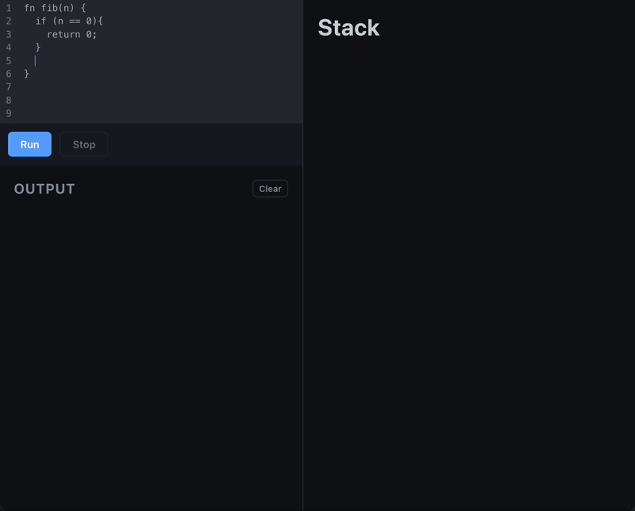

# Interpreter-ts

A tree-walking interpreter for a small scripting language, written from scratch in TypeScript, paired with a React UI for visually stepping through execution — call stack, heap, and source highlighting all update live as the program runs.



## What's in this project

- **Tokenizer** (`src/interpreter/frontend/tokenizer.ts`) — turns source text into a token stream (keywords, identifiers, strings, numbers, symbols).
- **Parser** (`src/interpreter/frontend/parser.ts`, `ast.ts`) — a recursive-descent / Pratt parser that builds an AST from tokens. Grammar notes live in [`src/interpreter/spec/syntax.md`](src/interpreter/spec/syntax.md) and [`src/interpreter/spec/tokens.md`](src/interpreter/spec/tokens.md).
- **Backend** (`src/interpreter/backend/`) — walks the AST and executes it:
  - `memory.ts` — heap, call stack, and lexical environments (LEGB scoping: local, enclosing, global, builtin)
  - `exec.ts` / `context.ts` — the step-by-step execution engine
  - `builtin.ts` — built-in functions (e.g. `print`)
  - `diagnostics.ts` / `run.ts` — the `Executor` class, which exposes a resumable `advance()` step so the UI can pause on breakpoints and inspect state between steps
- **UI** (`src/App.tsx`, `Code.tsx`, `Stack.tsx`, `Output.tsx`, `Controls.tsx`) — a CodeMirror-based editor with breakpoint gutter and execution-line highlighting, a live call stack/heap inspector with expandable objects and arrays, and a console for `print` output.

## Language features

Variables and assignment, `if` / `else if` / `else`, `while` loops, functions (`fn`) with `return`, arrays and objects (with property/element access and calls), and the usual arithmetic, comparison, and logical operators.

## Getting started

```bash
npm install
npm run dev      # start the dev server
npm run build    # type-check and build for production
npm run lint      # run eslint
npm run preview   # preview the production build
```

## How it works

Clicking **Run** tokenizes and parses the current editor contents into an AST, then hands it to an `Executor`. Each click of **Run** afterward calls `advance()`, which walks the AST one logical step at a time, pausing whenever it hits a breakpoint (set via the editor gutter) or when the program finishes. After each step the UI re-renders the current source location, the call stack, and a snapshot of the heap, so you can watch variables, objects, and arrays change as the program executes.
